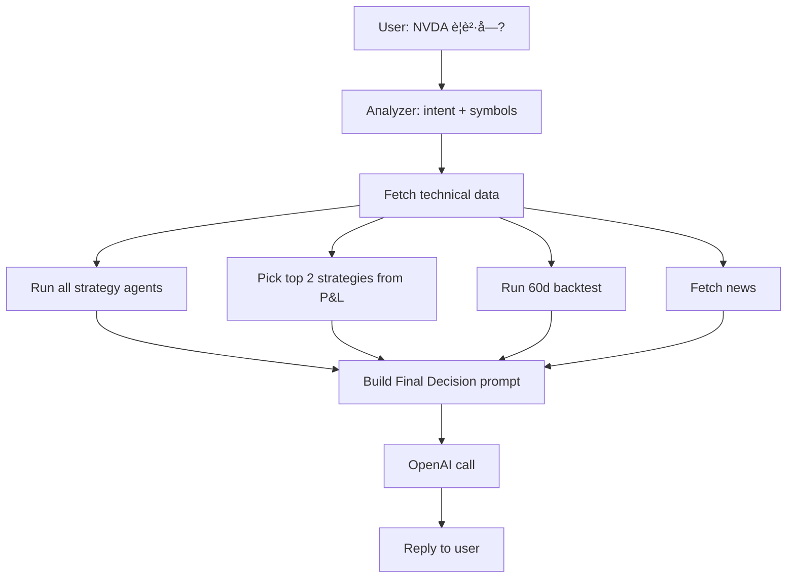
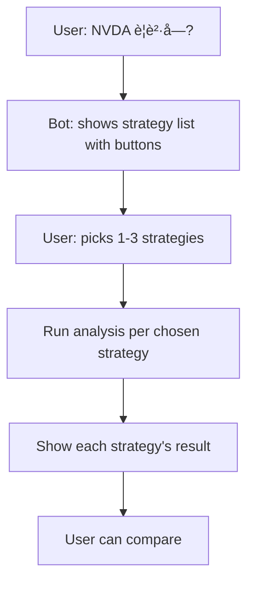

# Current Flow Explained – Stock Analysis & Backtester

Answers: How does the bot analyze? Where do support/resistance come from? How does backtester work? What candles/timeframes?

---

## 1. Current analysis flow (when you ask "NVDA è¦è²·å—?")



**Step-by-step:**

1. **Analyzer** (`agents/analyzer.py`) → parses "NVDA è¦è²·å—?" → intent = `stock_analysis`, symbols = `["NVDA"]`.

2. **Technical data** (`core/data_manager.get_extended_stock_data("NVDA")`) → fetches from Finnhub (if available) or Yahoo Finance:
   - **Daily historical** (1 month): calculates EMA9, EMA21, RSI (14-period), support (20-day low), resistance (20-day high), average volume.
   - **Intraday (5-minute)**: gets latest price (including pre-market/after-hours when `prepost=True`).
   - Returns: current_price, ema_9, ema_21, rsi, support, resistance, volume_ratio, trend (bullish/bearish/neutral), session (regular/extended), last_update timestamp.

3. **Consensus** (`strategy_orchestrator.get_consensus_signal(market_data, "NVDA")`) → runs **all** strategy agents (13 in your case):
   - Each **StrategyAgent** (`strategy_agents/base_agent.py`) is a **rule-based evaluator** for one skill (e.g. "EMA Crossover", "Volume Breakout", "RSI Divergence", "Support/Resistance", etc.).
   - Each agent looks at EMA9, EMA21, RSI, volume_ratio, support, resistance, trend and returns BUY/SELL/HOLD + confidence (0-100) + reasoning.
   - **Orchestrator aggregates**: if BUY count > SELL count and >= total/3 → action = BUY; else if SELL > BUY and >= total/3 → SELL; else HOLD. Average confidence. Top 3 signals by confidence.
   - Example from your output: 0/13 BUY, 0/13 SELL, 13/13 HOLD → consensus = HOLD.

4. **Strategy pick** (`agents/strategy_generator.py`) → loads `strategies.json` (tracks per-strategy wins, losses, profit from past user trades), ranks by win rate then P&L, picks top 2.

5. **Backtest** (`backtester.run_backtest("NVDA", orchestrator, days=60)`) → fetches **60 days of DAILY OHLCV** from Yahoo (`interval="1d"`), calculates EMA9/21, RSI, support/resistance for each day, then for each day (from day 21 onward) builds market_data and calls `orchestrator.get_consensus_signal()` to get BUY/SELL/HOLD for that day. Counts: BUY days, SELL days, HOLD days. **No P&L calculation** (only signal counts). Returns e.g. "BUY 12d SELL 5d HOLD 43d".

6. **News** (inline in `telegram_bot.py`) → fetches Yahoo RSS headline for the symbol (up to 2 symbols), returns one line per symbol.

7. **Final Decision** (`agents/final_decision.build_prompts(...)`) → builds system prompt (rules from `ai_rules/`, account line, learning context, stock decision rule: "Use [Data], [Consensus], [Strategy pick], [Backtest], [News]. Output 建議/入場/目標/æ­¢æ in 100 words.") + user prompt (user query + all the context: [Data], [Consensus], [Fit], [Strategy pick], [Backtest], [News]). Max tokens 180.

8. **LLM** (`client.chat.completions.create(...)`) → OpenAI gpt-4o-mini with system + user, returns the text you saw (Technical, Consensus, Setup, Why).

9. **Reply** → bot adds emoji/prefix ("🧠 AI 交易分æ") and buttons (ä¹°å…¥, 观察) and sends to Telegram.

---

## 2. How support and resistance are calculated

From `core/data_manager.py` (Yahoo path):

- **Support** = 20-day minimum of "Low" prices (`hist_data['Low'].tail(20).min()`).
- **Resistance** = 20-day maximum of "High" prices (`hist_data['High'].tail(20).max()`).

So: rolling 20-day range. If NVDA traded $188–$193 over the last 20 days, support = $188, resistance = $193.

From Finnhub path (if used):

- Support/resistance are **not** provided by Finnhub API. The fallback is to fetch 20 days and compute the same way (min Low, max High).

---

## 3. How backtester works

**Code:** `backtester.py` `run_backtest(symbol, orchestrator, days=60)`

- **Data:** Yahoo Finance **daily** candles (`interval="1d"`), period = 60 days (can change `days` parameter).
- **Indicators calculated per day:** EMA9, EMA21, RSI (14-period), volume_ratio (current / 20-day avg), support (20-day min Low), resistance (20-day max High).
- **Loop:** For each day (from day 21 onward, so indicators have enough data), build `market_data` dict from that day's row:
  ```python
  market_data = {
      "current_price": Close,
      "ema_9": ema_9,
      "ema_21": ema_21,
      "rsi": rsi,
      "volume_ratio": volume / 20d_avg_volume,
      "support": 20d_min_Low,
      "resistance": 20d_max_High,
      "trend_en": "bullish" if Close > ema_9 else "bearish",
  }
  ```
- **Get signal:** Call `orchestrator.get_consensus_signal(market_data, symbol)` → returns BUY/SELL/HOLD (from all 13 strategy agents).
- **Count:** If BUY → buy_days += 1; if SELL → sell_days += 1; else hold_days.
- **No P&L or trade simulation:** Only counts which days gave which signal. Does **not** simulate entries/exits or compute profit. For example: "BUY 12d SELL 5d HOLD 43d" means on 12 of the 60 days, consensus was BUY (but we don't know if a trade that day would be profitable).

**Summary:**
- **Timeframe:** Daily candles, 60 days.
- **No intraday:** No 1-min, 5-min, or hourly candles in backtest (only in live data fetch for current price).
- **No P&L:** Only signal distribution (BUY/SELL/HOLD counts).

---

## 4. Where the LLM decides buy/sell/entry/target/stop

The LLM (`gpt-4o-mini`) receives the concatenated context (data, consensus, backtest, news) and the Final Decision rule:

```
You are the Final Decision agent. You receive: [Data] technicals, [Consensus] and [Fit] strategies, [Strategy pick] top strategies by performance, [Backtest] 60d signal distribution, [News]. Use all of these. Output MUST be short and help the user decide (max 100 words).
Required format: â‘  建議: BUY / SELL / 觀望 â‘¡ 入場 $X.XX â‘¢ 目標 $X.XX â‘£ æ­¢æ $X.XX ⑤ 一å¥ç†ç”± (mention strategy if [Strategy pick] or [Fit] present).
If consensus is all HOLD, do NOT say "neutral" and stop. Say 觀望 and give a CONCRETE trigger (e.g. çªç ´ $X å¯è€ƒæ…®è²·å…¥ / 跌破 $Y æ­¢æ). If there is important news in [News], summarize in one short line. Use support/resistance from data for entry/target/stop when possible.
```

So the **model** chooses the final 建議 (BUY/SELL/觀望), entry, target, stop based on:
- **Technical data** (price, EMA, RSI, support, resistance, volume).
- **Consensus** (0/13 BUY, 13/13 HOLD in your example).
- **Backtest** (historical signal distribution).
- **News** (if present).
- **Strategy pick** (top 2 by P&L, e.g. "EMA Crossover, Volume Breakout").

The entry/target/stop prices come from **support/resistance** (e.g. stop slightly below support, target at/above resistance) and the model's reasoning.

**In your NVDA example:**
- Consensus = 13/13 HOLD → model said "觀望" (holding).
- Setup: Entry $190 (current), Target $193.26 (near resistance), Stop $188.77 (below support).
- The model used the support $188.xx and resistance $193.xx from the data to set these levels.

---

## 5. What you want to change (understood)

You said:
- Not really useful in current form.
- You want to **choose a strategy first**, then see results **per strategy** (so different strategies give different buy/in/out), and **compare** them.
- Content needs improvement.

**New flow (conceptual):**



So:
1. User asks about a symbol.
2. Bot shows 5–10 strategy buttons (EMA Crossover, RSI, Volume Breakout, etc.).
3. User picks 1–3.
4. Bot runs the picked strategies **individually** (not consensus) and shows per-strategy result: 建議, 入場, 目標, æ­¢æ, 60d backtest (BUY/SELL/HOLD days for that strategy only), confidence, reason.
5. User compares: "EMA Crossover says BUY entry $190 stop $188 target $195; RSI says HOLD until RSI < 40."

**Needed changes:**
- **Per-strategy analysis** (not just consensus): Run each strategy agent alone and show its signal + backtest for that strategy (not aggregate).
- **Interactive flow:** After symbol, show strategy buttons; on button press, run and show that strategy's result.
- **Backtest per strategy:** Current `run_backtest` uses the orchestrator (all strategies together). Need a way to run backtest with **one** strategy at a time, or track per-strategy BUY/SELL/HOLD counts in the backtest loop.
- **Compare UI:** Show side-by-side or list all chosen strategies with their entry/target/stop so you can pick which one to follow.

I'll create a plan for this.
</thinking>

Creating a detailed current-flow explanation document and a plan for the strategy-selection-first flow.

<function_calls>
<invoke name="CreatePlan">
<parameter name="name">Strategy selection and comparison